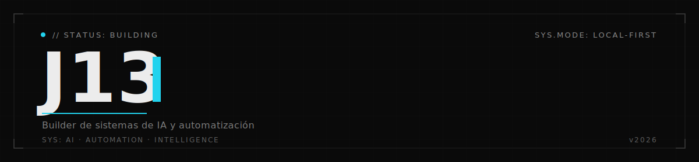

<!--
====================================================================
  README de perfil de GitHub — repo especial: J0013/J0013
  Tema: oscuro + acento cian (#22D3EE) · marca Triskel · banner estilo Palantir
  Pendiente: triskelai.com aún no está live (dominio futuro)
====================================================================
-->

<!-- ===================== BANNER SUPERIOR (SVG custom · estilo Palantir) ===================== -->

<!-- ===================== TYPING ANIMATION ===================== -->

<!-- ===================== SALUDO + METADATOS + BIO (alineado izquierda · Palantir) ===================== -->
<h1 align="left">Hola, soy Javier Núñez Paredes — J13</h1>

<!-- fila de metadatos estilo terminal: badges flat-square sobrios, cian como acento -->

<!-- ===================== BIO CORTA ===================== -->
Construyo dos cosas: automatizaciones que quitan trabajo manual a negocios, y sistemas de inteligencia empresarial que corren en local — para empresas que no quieren que sus datos salgan a la nube.

 

<!-- ===================== CURRENTLY BUILDING ===================== -->
## 🚧 Currently building

<table>
<tr>
<td width="60" align="center">🔻</td>
<td>

**[Triskel](https://triskelai.com)** &nbsp;·&nbsp; `triskelai.com`

Automatización de procesos + inteligencia empresarial sobre infraestructura local.
IA que corre en la oficina del cliente, sin que los datos salgan de ahí.

En construcción.

</td>
</tr>
</table>

 

<!-- ===================== STACK TÉCNICO ===================== -->
## 🧰 Stack

**Lenguajes**

**IA & Automatización**

**Frontend**

**Backend & Data**

**DevOps & Cloud**

 

<!-- ===================== FOCO ACTUAL (cualitativo · sustituye stats/trophies) ===================== -->
## 🎯 Foco actual

Construyendo **Triskel** — dos líneas de producto:

— **Automatización** · flujos que quitan trabajo manual a negocios. 
— **Inteligencia empresarial** · IA local que convierte información dispersa en decisiones, sin que los datos salgan de la oficina.

 

<!-- ===================== CÓMO CONSTRUYO ===================== -->
## ⚙️ Cómo construyo

— Sistemas modulares, no scripts sueltos. 
— IA local primero: soberanía del dato sobre comodidad. 
— Automatización sobre infraestructura propia, no dependencias de terceros. 
— Menos humo, más sistemas que funcionan solos.

 

<!-- ===================== SNAKE ANIMATION ===================== -->
## 🐍 Contribution graph

<!--
  La genera el workflow .github/workflows/snake.yml a la rama "output".
  Si aún no has activado el Action, estas imágenes saldrán rotas hasta el primer run.
-->

<picture>
  <source media="(prefers-color-scheme: dark)" srcset="https://raw.githubusercontent.com/J0013/J0013/output/github-snake-dark.svg" />
  <source media="(prefers-color-scheme: light)" srcset="https://raw.githubusercontent.com/J0013/J0013/output/github-snake.svg" />
  
</picture>

 

<!-- ===================== CONTACTO ===================== -->
## 📡 Dónde encontrarme

 

<!-- ===================== FOOTER (sobrio · coherente con banner Palantir) ===================== -->

---

<code>J13 · 2026 · Información. Decisión. Acción. · triskelai.com</code>

